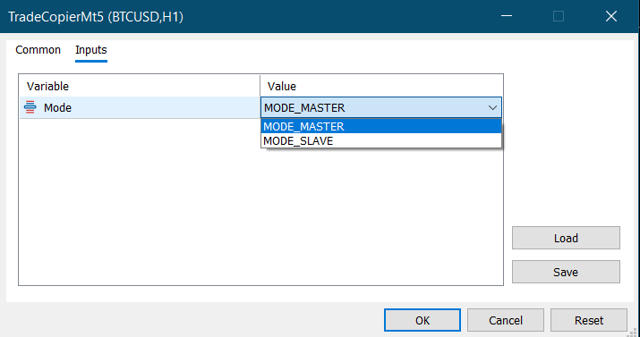

# MQL5 Trade Copier EA

A MetaTrader 5 Expert Advisor that demonstrates a simple **master-slave trade copier** system using MQL5.

The EA can be used across multiple MT5 terminals. One terminal works as the **master account**, while another terminal works as the **slave account**. The slave account reads the master account's position data and copies position opening, stop-loss/take-profit modification, and position closing.

> ⚠️ This project is for educational and portfolio demonstration purposes only. Trading involves risk. It is not financial advice and does not guarantee profitable results.

---

## Overview

MQL5 Trade Copier EA is a file-based trade copier built for MetaTrader 5.

The EA has two operating modes:

* **Master Mode**
* **Slave Mode**

In master mode, the EA writes active position information to a common file.
In slave mode, the EA reads that file and synchronizes the slave account with the master account.

This project demonstrates practical MQL5 concepts such as:

* Multi-terminal communication
* File-based data sharing
* Position reading and synchronization
* Trade execution using `CTrade`
* Stop-loss and take-profit modification
* Position closing logic
* Master/slave account structure

---

## Key Features

* Master and slave mode selection
* Works across multiple MetaTrader 5 terminals
* Copies buy positions
* Copies sell positions
* Copies lot size
* Copies trading symbol
* Copies stop-loss level
* Copies take-profit level
* Updates SL/TP when master position is modified
* Closes slave positions when the master position is closed
* Uses master position ticket as slave trade comment for tracking
* Uses MetaTrader common file storage for communication
* Built with MQL5 and `CTrade`

---

## How It Works

The EA uses a shared binary file in the MetaTrader common files directory.

### Master Mode

When the EA is set to master mode, it scans all open positions on the master terminal.

For each position, it writes the following information into a binary file:

* Position ticket
* Symbol
* Lot size
* Position type
* Open price
* Stop loss
* Take profit

The file is updated using a timer event.

---

### Slave Mode

When the EA is set to slave mode, it reads the master position data from the shared file.

The slave EA then checks whether each master position already exists on the slave account.

If the position does not exist, the slave EA opens a matching buy or sell position.

If the position already exists but the stop-loss or take-profit is different, the slave EA updates the position.

If a slave position no longer exists on the master account, the slave EA closes that position.

---

## Supported Synchronization

This EA currently supports synchronization of:

* Market buy positions
* Market sell positions
* Position volume
* Symbol
* Stop loss
* Take profit
* Position closing

---

## Current Limitation

This version is a simple portfolio/demo trade copier.

It does not currently copy:

* Pending orders
* Partial closes
* Different lot size multipliers
* Symbol mapping between brokers
* Magic number filtering
* Slippage control settings
* Reverse copying
* Cross-broker symbol suffix/prefix adjustment

These features can be added in future versions.

---

## Input Parameters

| Input         | Description                                                          |
| ------------- | -------------------------------------------------------------------- |
| `Mode`        | Select whether the EA works as master or slave                       |
| `MODE_MASTER` | Writes master position data to the common file                       |
| `MODE_SLAVE`  | Reads master position data and copies positions to the slave account |


---

## Screenshot

### Input Settings



### Charts 


---

## Installation

1. Download `TradeCopierEA.mq5`.
2. Open MetaTrader 5.
3. Go to:

```text
File > Open Data Folder > MQL5 > Experts
```

4. Copy `TradeCopierEA.mq5` into the `Experts` folder.
5. Restart MetaTrader 5 or refresh the Navigator panel.
6. Attach the EA to the master account chart and select:

```text
MODE_MASTER
```

7. Attach the EA to the slave account chart and select:

```text
MODE_SLAVE
```

8. Enable Algo Trading on both MT5 terminals.

---

## Important Setup Note

The master and slave terminals must be able to access the MetaTrader common files directory.

This EA uses:

```mql5
FILE_COMMON
```

for file sharing.

The same EA name should be used on both terminals so both master and slave read/write the same file name.

---

## Risk Warning

Trade copiers can carry significant risk.

Execution speed, spread, slippage, symbol differences, broker rules, margin requirements, and connection issues can cause differences between master and slave accounts.

Always test on demo accounts first.

The developer is not responsible for any trading losses.

---


## Developer

**MubinCodes**
Software Developer specializing in MQL4/MQL5 trading bots, custom indicators, Python automation, and financial software.

GitHub: https://github.com/MubinCodes
Fiverr: https://www.fiverr.com/mubinbhaiya?public_mode=true
